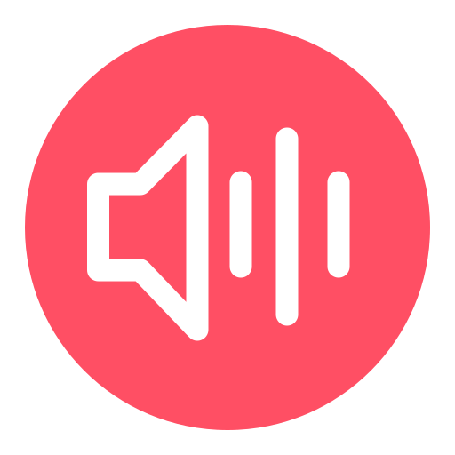

# Godot Soundboard
A simple soundboard, TTS, and audio clipping/replay software built with Godot and Python, for Windows.

Python is not required if you wish to use the EXE files provided in the releases. I have compiled the Python backend into a single EXE file using pyinstaller.

# Requirements
[VB Audio Cable](https://vb-audio.com/Cable/) (REQUIRED)

[VAC](https://vac.muzychenko.net/en/download.htm), or anything similar that lets you route output audio through an input device. (optional, only needed for the clipper)

[Audacity](https://www.audacityteam.org/download/) (optional, only needed for processing clips export via clipper)

[Friends](https://discord.gg/DKJBCxDvEw) (optional, you can also play the sounds for yourself)

# Screenshots

# NOTE
This project isn't finished. Currently there's no tutorials explaining how to install VB Audio Cable (REQUIRED TO USE SOFTWARE), or how to set up the clipper.

I plan to add a settings menu to configure devices as well, so you aren't forced to use VB, and will be able to just play it through your headphones/speakers if you would like. The code is pretty simple (and ugly), anyone can feel free to move the process along faster. I can't promise fast updates on tutorials unless this gains some traction, as I just made this primarily for me and my friends.

# Credits
[Godot Engine](https://github.com/godotengine/godot)
